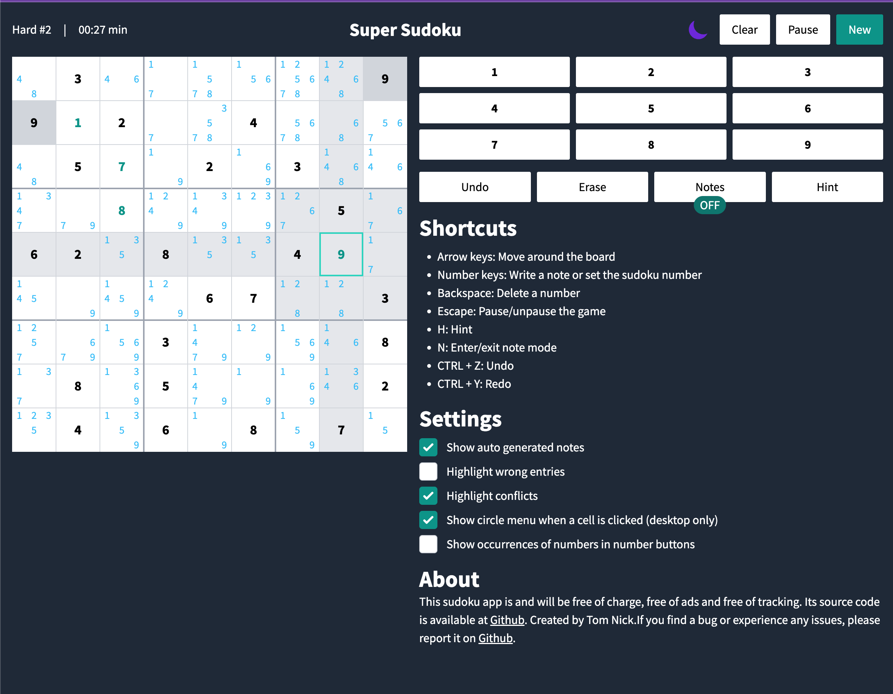

# Super Sudoku 🧩

[](https://sudoku.tn1ck.com)
[](LICENSE)
[](https://nodejs.org/)

**A feature-rich, open-source Sudoku game that rivals commercial applications**

🌐 **Live Demo**: [https://sudoku.tn1ck.com](https://sudoku.tn1ck.com)



## ✨ Why Super Sudoku?

Born from a simple request - my Grandma wanted to play Sudoku, but I wasn't satisfied with the available options. This project aims to create an open-source Sudoku experience that matches or exceeds commercial applications, making quality puzzle gaming accessible to everyone.

## 🚀 Key Features

### 🎮 **Core Gameplay**
- **3000 Puzzles**: Carefully created puzzles across 5 difficulty levels
- **Smart Hints**: Get help when you're stuck without spoiling the challenge
- **Undo/Redo**: Full history tracking with CMD/CTRL + Z & Y shortcuts
- **Progress Saving**: Never lose your place - automatic save functionality
- **Create your own**: Design custom puzzles with built-in validation checking

### 📝 **Advanced Note System**
- **Smart Notes**: Automatic note generation and management
- **Custom Notes**: Add your own annotations and strategies
- **Conflict Detection**: Real-time highlighting of errors and conflicts
- **Number Tracking**: Visual indicators showing number occurrences

### ⌨️ **Keyboard Shortcuts**
| Action | Key |
|--------|-----|
| **Navigate** | Arrow Keys |
| **Input Numbers** | 1-9 Keys |
| **Delete** | Backspace |
| **Pause/Resume** | Escape |
| **Get Hint** | H |
| **Toggle Notes** | N |
| **Undo/Redo** | CMD/CTRL + Z/Y |

### 🎯 **Smart Features**
- **Auto-save**: Your progress is automatically saved
- **Difficulty Progression**: Start easy, work your way up
- **Clean Interface**: Distraction-free, modern design
- **Mobile Responsive**: Play on any device

## 🛠️ Development Setup

### Prerequisites
- **Node.js** (version 20 or higher) - [Download here](https://nodejs.org/en/download/package-manager/)

### Quick Start
```bash
# Clone the repository
git clone https://github.com/tn1ck/super-sudoku.git
cd super-sudoku

# Install dependencies
npm install

# Start development server
npm start
```

The app will be available at [http://127.0.0.1:3000](http://127.0.0.1:3000)

### Build for Production
```bash
npm run build
```
Generated files will be in the `dist` directory.

## 🐳 Docker Deployment

### Quick Docker Setup
```bash
# Build the image
docker build -t super-sudoku:latest .

# Run the container (map to your preferred port)
docker run -p 8081:80 super-sudoku:latest
```

### Pre-built Images
Ready-to-use images are available at [GitHub Container Registry](https://github.com/tn1ck/super-sudoku/pkgs/container/super-sudoku).

## 🧩 Puzzle Generation

Super Sudoku includes a sophisticated puzzle generation system based on research from "Rating and Generating Sudoku Puzzles Based On Constraint Satisfaction Problems."

### Generation Tools
- **`generate_sudokus.ts`**: Generate new puzzles by difficulty level

### Future Plans
- User interface for custom puzzle generation
- Community puzzle sharing
- Advanced difficulty algorithms

## 🤝 Contributing

We welcome contributions! Here's how you can help:

1. **Fork** the repository
2. **Create** a feature branch (`git checkout -b feature/amazing-feature`)
3. **Commit** your changes (`git commit -m 'Add amazing feature'`)
4. **Push** to the branch (`git push origin feature/amazing-feature`)
5. **Open** a Pull Request

### Areas for Contribution
- 🎨 UI/UX improvements
- 🧩 New puzzle generation algorithms
- 🐛 Bug fixes
- 📱 Mobile optimization
- 🌍 Internationalization
- 🎮 New game modes

## 📄 License

This project is licensed under the MIT License - see the [LICENSE](LICENSE) file for details.

## 🙏 Acknowledgments

- Research paper: "Rating and Generating Sudoku Puzzles Based On Constraint Satisfaction Problems"
- The open-source community for inspiration and tools
- My Grandma for the original motivation! ❤️

---

**Missing a feature?** [Open an issue](https://github.com/tn1ck/super-sudoku/issues) and let us know!
