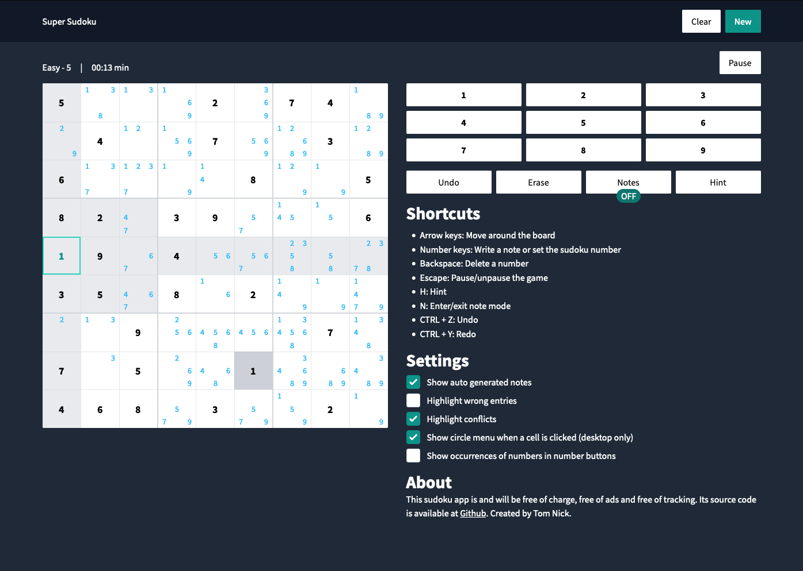

# Super Sudoku

Currently hosted at [https://sudoku.tn1ck.com](https://sudoku.tn1ck.com).




This project aims to be a sudoku app with everything included. An open source sudoku that is on par with all commercial applications. Why? Because my Grandma wanted to play a Sudoku once and I didn't like all the available offers. This has changed since then, but having an open source version will hopefully help people in the future.

## Features include:

- 100 sudokus for 5 different difficulties
- Save the users progress
- Generate Notes, custom notes
- Undo & hints
- Highlighting of conflicts and wrong entries
- Show occurrences of numbers in the buttons
- Shortcuts
    - Arrow keys: Move around the board
    - Number keys: Write a note or set the sudoku number
    - Backspace: Delete a number
    - Escape: Pause/unpause the game
    - H: Hint
    - N: Enter/exit note mode
    - Undo/Redo: CMD/CTRL + Z & CMD/CTRL + Y


If something is missing, open an issue!

## Development Setup

You need nodejs to run this project. Check [here](https://nodejs.org/en/download/package-manager/) on how to install nodejs if you haven't done it yet. This project was tested with version 20.

If you have node installed, execute in a terminal:

```
npm install
npm start
```

The app should be available on [http://127.0.0.1:3000](http://127.0.0.1:3000).

To build the project, execute `npm run build`, the generated files are in the `dist` directory.

## Run it using Docker

A docker image is provided to build the application and serve it using NGINX at port 80.

Build the image: `docker build -t super-sudoku:latest .`
Run the image: `docker run -p 8081:80 super-sudoku:latest` (Change 8081 for the port you want to map it to locally).

Automatically build images are available at [https://github.com/tn1ck/super-sudoku/pkgs/container/super-sudoku](https://github.com/tn1ck/super-sudoku/pkgs/container/super-sudoku).

## Solve & Generate Sudokus

A generator was build to create an infinite amount of sudokus for every difficulty Level.
The generator is mostly based on the paper "Rating and Generating Sudoku Puzzles Based On Constraint Satisfaction Problems".
Currently I include a few hundred sudokus with this app, in the future it would be nice if a user could generate more if he would like to / having an interface to create new sudokus.

There are two scripts included in this project:

* `generate_sudokus.ts` - given a difficulty level and number of sudokus it will generate these and append the results to the `sudokus.txt` file
* `read_sudokus.ts` - reads the `sudokus.txt` file and creates a `sudokus.json` which is used in the application itself. It adds some more data and changes the datastructure. The contents need then to be placed in `src/assets/sudokus.ts`. I also format the file with prettier, to make it prettier.

## Contribution

Every contribution is welcome! Simply fork the project and create a PR. You can also create an issue and ask for a feature.
